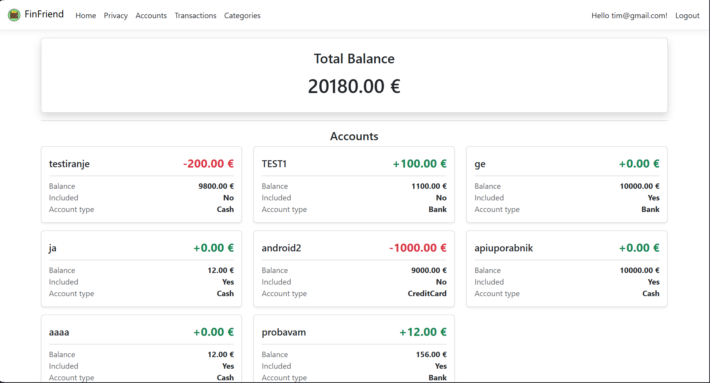
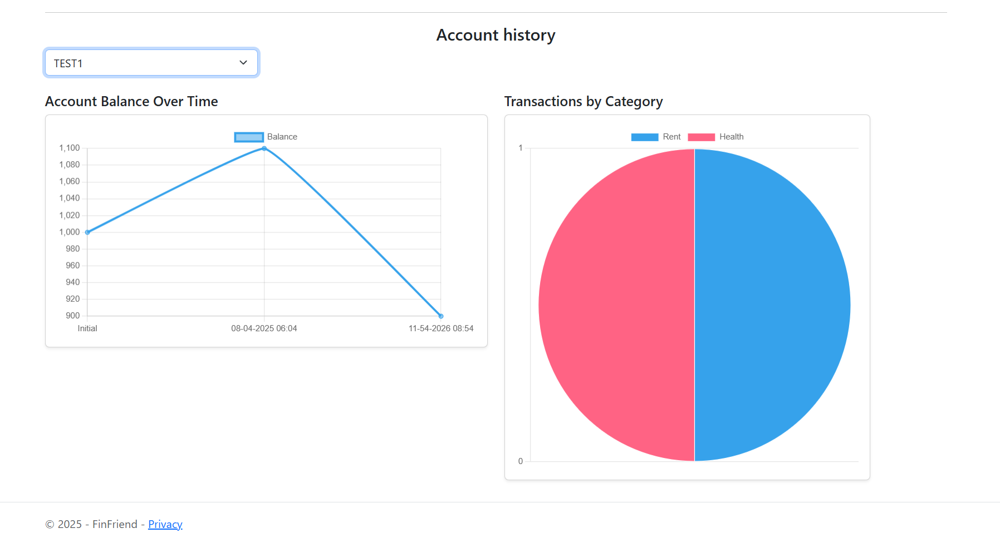
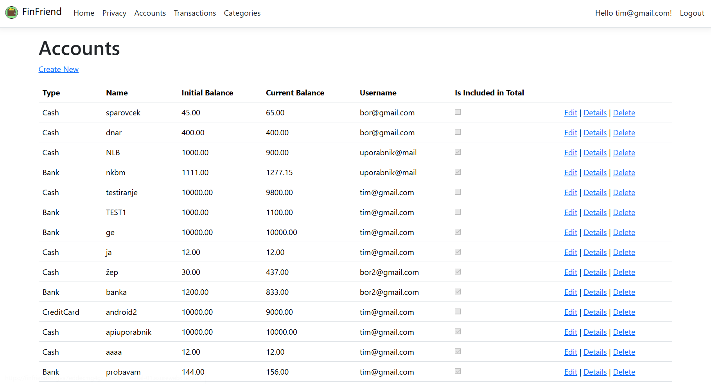
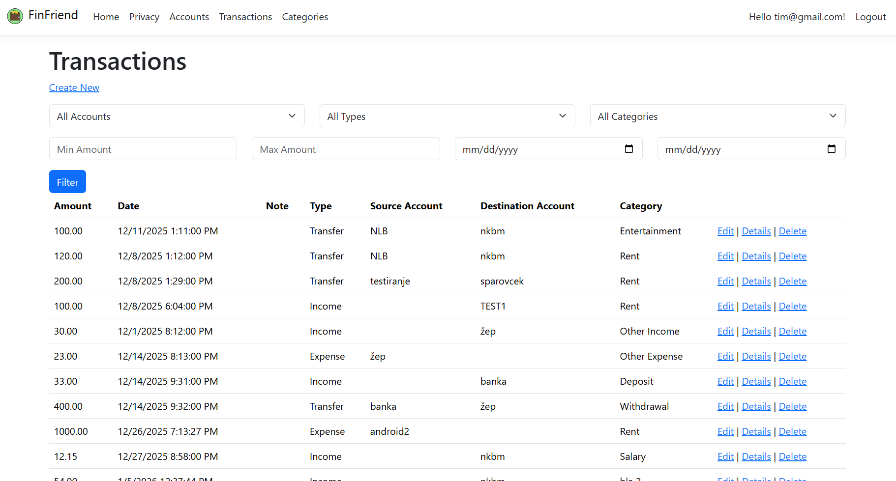
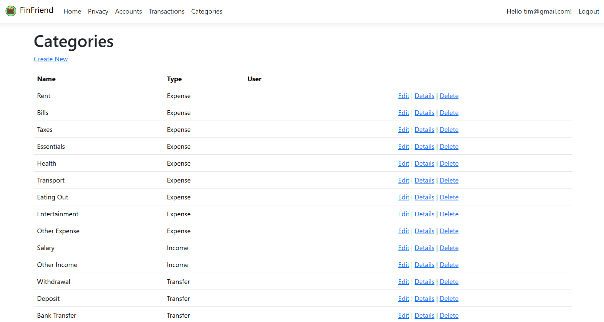
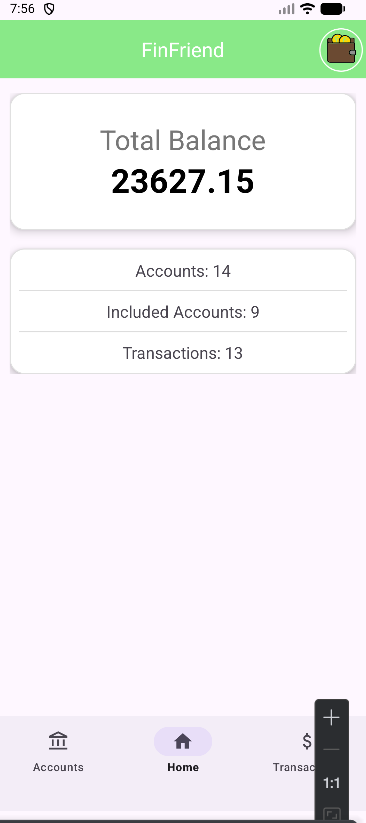
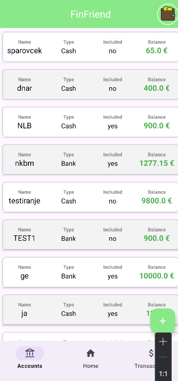
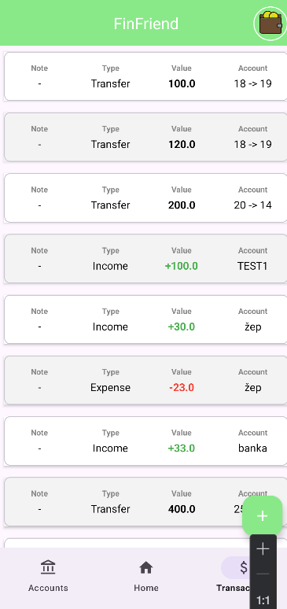
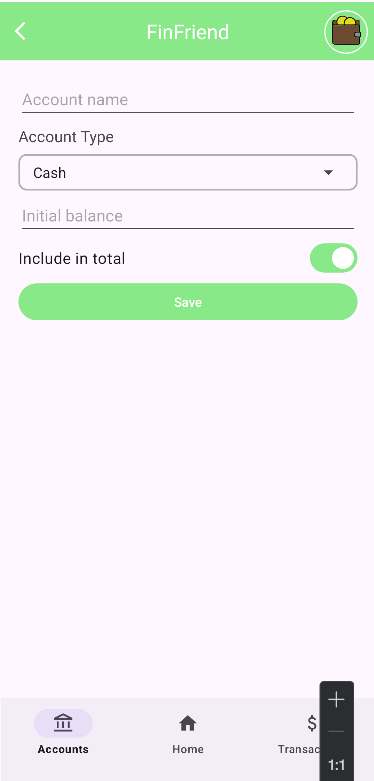
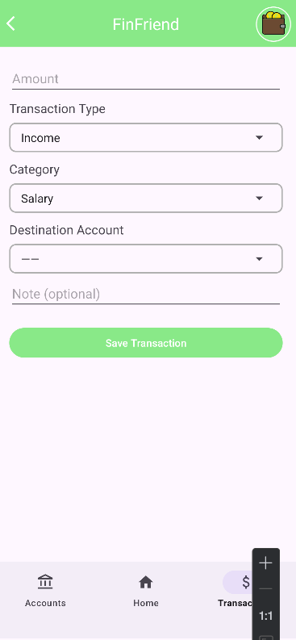

# FinFriend

## Clana ekipe
63240140 Tim Kavčič
63230068 Bor Furlan

## Delovanje
Za uporabo se je potrebno prijaviti oziroma registrirati. Omogoca uporabnikom shranjevanje svojih prihodkov in odhodkov ter pregled nad njimi. Na home strani prikaze skupni sestevek vseh racunov in statistike porabe, potem pa imamo se poebej podatke o vseh racunih in transakcijah uporabnika. Vsaka transakcija je opredeljena na podlagi kategorije.
Admin ima dostop in vidi vse podatke vseh uporabnikov, navaden uporabnik pa samo do svojih.

## Naloge studentov
Razdelila sva si jih pravicno. Eden je poskrbel za definiranje prvih entitet in postavljanje podatkovne baze, drugi pa za izolacijo podatkov. Potem pa je vsak poskrbel za izobljsanje uporabnikove izkusnje pri dodajanju/spreminjanju entitet. Na koncu pa je en dokoncal spletno aplikacijo in naredil home screen, drugi pa naredil mobilno aplikacijo.

## graficni vmesniki spletne aplikacije
https://finfriend-evgva7eddecmg4gz.swedencentral-01.azurewebsites.net

## graficni vmesniki mobilne aplikacije

## shema podatkovne baze

                                +----------------------+
                                |        USERS         |
                                +----------------------+
    +---------------------------| UserId (PK)          |----------------------------------------------------------+
    |                           | FirstName            |                                                          |
    |                           | LastName             |                                                          |
    |                           | DateOfBirth          |                                                          |
    |                           | LastName             |                                                          |
    |                           | Email                |                                                          |
    |                           +----------+-----------+                                                          |
    |                                                                                                             |
    |                                                                                                             |
    |                                                                                                             |
    |   +----------------------+          +-----------------------------+           +----------------------+      |
    |   |      ACCOUNTS        |          |        TRANSACTIONS         |           |      CATEGORIES      |      |
    |   +----------------------+          +-----------------------------+           +----------------------+      |
    |   | AccountId (PK)       |-+        | TransactionId (PK)          |       +---| CategoryId (PK)      |      |
    |   | Type                 | |        | Amount                      |       |   | Name                 |      |
    |   | Name                 | |        | Date                        |       |   | Type                 |      |
    |   | InitialBalance       | |        | Note                        |       |   | UserId (FK)          |------+
    |   | CurrentBalance       | |        | Type                        |       |   +----------------------+
    +---| UserId (FK)          | +-----+--| SourceAccountId (FK)        |       |
        | IsIncludedInTotal    |       +--| DestinationAccountId (FK)   |       |
        +----------------------+          | CategoryId (FK)             |-------+
                                          +-----------------------------+

